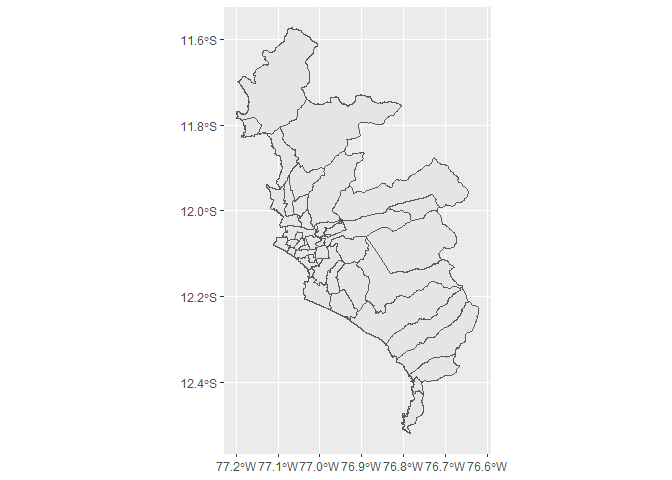

<!-- README.md is generated from README.Rmd. Please edit that file -->

# perumapas

<!-- badges: start -->

[](https://lifecycle.r-lib.org/articles/stages.html#experimental)
[](https://CRAN.R-project.org/package=perumapas)
<!-- badges: end -->

The goal of `perumapas` is to have an easy way to draw maps with
peruvian shapes.

## Installation

You can install the released version of perumapas from the
[calderonsamuel r-universe](https://calderonsamuel.r-universe.dev/)
with:

``` r
install.packages("perumapas", repos = 'https://calderonsamuel.r-universe.dev')
```

## Example

This is a basic example which shows you how to solve a common problem:

``` r
library(perumapas) # usar siempre junto con sf
library(sf) # obligatorio!
#> Linking to GEOS 3.9.1, GDAL 3.2.1, PROJ 7.2.1
library(ggplot2) # for plotting
library(dplyr) # for filtering
#> 
#> Attaching package: 'dplyr'
#> The following objects are masked from 'package:stats':
#> 
#>     filter, lag
#> The following objects are masked from 'package:base':
#> 
#>     intersect, setdiff, setequal, union
```

You can create maps easily.

``` r
mapa_distrital %>% 
  filter(departamento == "LIMA", provincia == "LIMA") %>% 
  ggplot() +
  geom_sf()
```



You have the *ubigeo* field to easily join/merge with another dataset.

``` r
head(mapa_distrital, 10)
#> Simple feature collection with 10 features and 4 fields
#> Geometry type: MULTIPOLYGON
#> Dimension:     XY
#> Bounding box:  xmin: -79.93157 ymin: -7.39816 xmax: -78.8421 ymax: -6.784193
#> Geodetic CRS:  WGS 84
#>    departamento  provincia     distrito ubigeo                       geometry
#> 1     CAJAMARCA  CONTUMAZA     GUZMANGO 060504 MULTIPOLYGON (((-78.91578 -...
#> 2     CAJAMARCA SAN MIGUEL     EL PRADO 061105 MULTIPOLYGON (((-79.01679 -...
#> 3     CAJAMARCA SAN MIGUEL       NIEPOS 061109 MULTIPOLYGON (((-79.21691 -...
#> 4     CAJAMARCA SAN MIGUEL SAN GREGORIO 061110 MULTIPOLYGON (((-79.08233 -...
#> 5     CAJAMARCA  SAN PABLO     SAN LUIS 061203 MULTIPOLYGON (((-78.87623 -...
#> 6    LAMBAYEQUE   CHICLAYO         ETEN 140103 MULTIPOLYGON (((-79.84212 -...
#> 7    LAMBAYEQUE   CHICLAYO  LA VICTORIA 140106 MULTIPOLYGON (((-79.83314 -...
#> 8    LAMBAYEQUE   CHICLAYO      LAGUNAS 140107 MULTIPOLYGON (((-79.66093 -...
#> 9    LAMBAYEQUE   CHICLAYO      MONSEFU 140108 MULTIPOLYGON (((-79.78014 -...
#> 10   LAMBAYEQUE   CHICLAYO   SANTA ROSA 140114 MULTIPOLYGON (((-79.89631 -...
```

To learn how to use `mapa_regional` and `mapa_provincial` see
`vignette('basic-usage')`.
